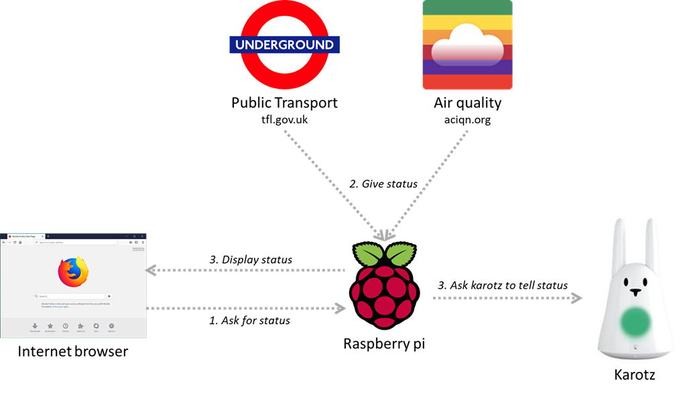
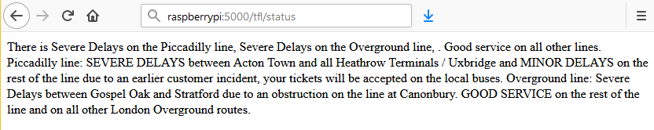
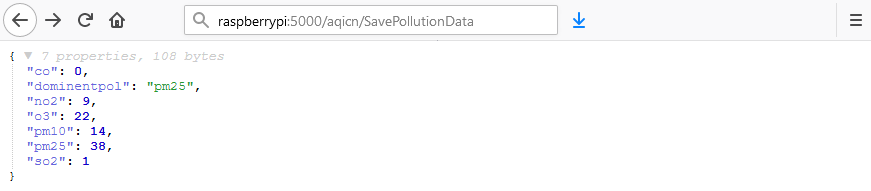
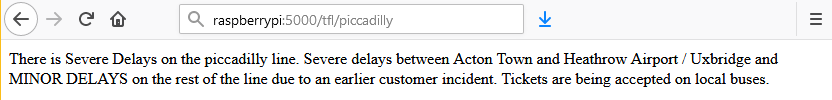
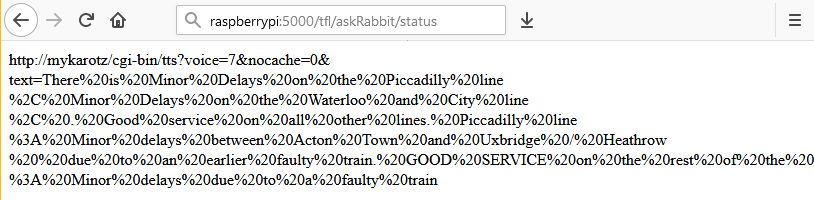
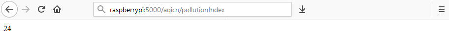
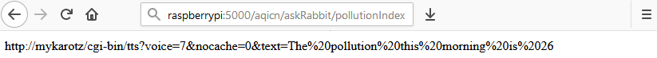

Raspberry Pi Home Server
===========================

A small home server running on raspberry pi that has API end points returning the status for London public transport and air quality. 

The status can be saved in a local file or read by a karotz.

The information is taken from Transport for London ([TFL](https://tfl.gov.uk/tube-dlr-overground/status/)) and the 
air pollution index ([aqicn.org](http://aqicn.org/city/london/)).

This is my very first published piece of code on Github, so feel free to comment / correct anything I might have done that does not follow the standard etiquette.

## System structure

## Usage example

You can get the current status on the London tube:

Or current readings of air quality around London:

You can also ask your karotz to tell you the current status. You can find a short video of what the bunny actually says [here](https://twitter.com/atilagiant/status/897742569228177408) 

# Getting started

## Prerequisites
* **SSH access** to the raspberry pi. See [here](https://www.raspberrypi.org/documentation/remote-access/ssh/).

* The raspberrypi **hostname**. It is `raspberrypi` by default.

* **Git** installed: `sudo apt-get install git`. Full git setup [here](https://raspberrypi.stackexchange.com/a/59726).

* **Python 3** installed. To check the Python version: `which python`

* **pip** installed: `sudo apt-get install python3-pip`

* **Flask** installed: `sudo pip3 install flask`

* **Config Parser** installed: `sudo pip3 install configparser`

## Setup
From the raspberry pi SSH session:
1. Download the source code folder: `git clone https://github.com/AdrienChenu/home-server-rpi`
2. Update to **config.ini**:

    * **Karotz IP address**    
    * **Token** for pollution data: Get it from this [website](http://aqicn.org/data-platform/token/#/) if you do not have one.
    * **Save Path**: Path where to save the pollution data, e.g. /home/impactik/aciqn_pollution_data
    * **Feed Sensor**: The location id from aqicn.com e.g. 5724 for London, UK.

3. Start the server `nohup python3 flaskServer.py &`

# Available end points

## Public Transport

1. TFL status for all lines: http://raspberrypi:5000/tfl/status

2. Line status: http://raspberrypi:5000/tfl/<`line`>

3. Ask the karotz to tell the transport status: http://raspberrypi:5000/tfl/askRabbit/<`line`>

_Possible values for `<line>`:_
    Bakerloo,
    Central,
    Circle,
    District,
    Hammersmith and City,
    Jubilee,
    Metropolitan,
    Northern,
    Piccadilly,
    Victoria,
    Waterloo and City,
    Overground,
    TfL Rail,
    DLR,
    Trams.

## Pollution Index

1. Current pollution index: http://raspberrypi:5000/aqicn/pollutionIndex

2. Save available pollution data: http://raspberrypi:5000/aqicn/SavePollutionData

3. Ask the karotz to tell the pollution index: http://raspberrypi:5000/aqicn/askRabbit/pollutionIndex

